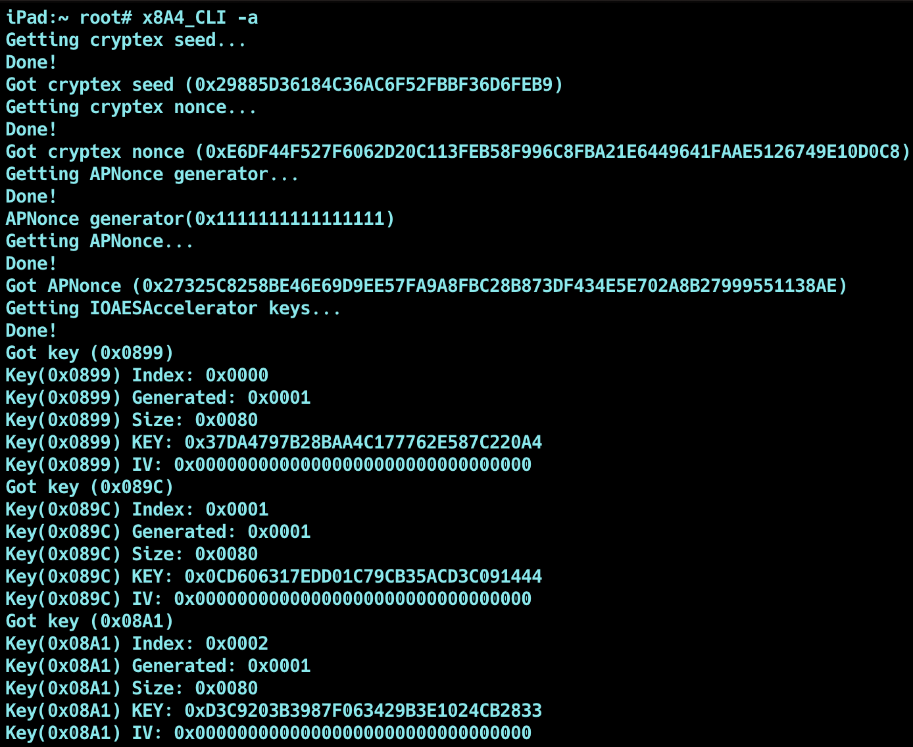
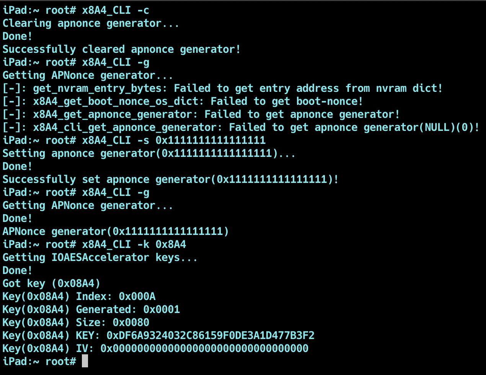
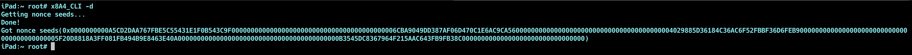

# x8A4

---
## About
An all-in-one tool for firmware nonces, seeds, and downgrade support
 
Get apnonce and generator, cryptex seed and cryptex nonce, dump nonce entanglement keys, set nonces and seeds for the purpose of restoring with saved blobs.

---
## Supported devices
* **Full jailbreak REQUIRED!**
* - x8A4 depends on full kernel read/write which is provided 
to the libkrw library by the jailbreak as a plugin
* **iOS/iPadOS 15.0-18.4**
* **RUN AS ROOT!**

---
## Credits
| User     | Repo                 | Description                                                                      |
|----------|----------------------|----------------------------------------------------------------------------------|
| [0x7FF]  | [dimentio]           | Thanks 0x7FF for making the original project x8A4 is based off of                |
| [stek29] | [nvram]              | Thanks to stek29 for figuring out the modern nvram unlock method                 |
| [stek29] | [nonce entanglement] | Thanks to stek29 for figuring out how apnonce works on a12+ (nonce entanglement) |
---

## Demo

---
## Research
[Original research](https://gist.github.com/Cryptiiiic/bd01fac6e8b8ee0c33f71c92cf91ce3d)
 
[iOS 16 Downgrading](https://gist.github.com/Cryptiiiic/b82133ac290070939189e1377dc3ac85)

---
## Usage

| option (short)   | option (long)   | description                                                                                                                                             |
|------------------|-----------------|---------------------------------------------------------------------------------------------------------------------------------------------------------|
| Options:         |
| ` -h `           | ` --help `      | Shows this help message                                                                                                                    |
| ` -v `           | ` --verbose `   | Enables this tool's verbose mode                                                                                                                    |
| ` -v `           | ` --verbose `   | Enables this tool's verbose mode                                                                                                                    |
| ` -a `           | ` --print-all ` | Dumps and prints everything :)                                                                                                                    |
| Cryptex Options: |
| ` -x `           | ` --get-cryptex-seed ` | Gets the current Cryptex1 boot seed from nvram                                                                                                                    |
| ` -t `           | ` --get-cryptex-nonce ` | Calculates the current Cryptex1 boot nonce                                                                                                                    |
| APNonce Options: |
| ` -g `           | ` --get-apnonce-generator ` | Gets the current APNonce generator from nvram                                                                                                                    |
| ` -n `           | ` --get-apnonce ` | Calculates the current APNonce                                                                                                                    |
| ` -s `           | ` --set-apnonce-generator ` | Set a specified APNonce generator in nvram                                                                                                                    |
| ` -c `           | ` --clear-apnonce-generator ` | Clears the current APNonce generator from nvram                                                                                                                    |
| Encryption Key Options: |
| ` -k `           | ` --get-accel-key ` | Gets a specified IOAESAccelerator encryption key from kernel via its ID                                                                                                                    |
| ` -l `           | ` --get-accel-keys ` | Dumps all of the IOAESAccelerator encryption keys from kernel                                                                                                                   |
| Seed Options: |
| ` -d `           | ` --get-nonce-seeds ` | Dumps all of the nonce seeds domains/nonce slots from nvram                                                                                                                   |
| Secret Menu Options: |
| ` -z `           | ` --set-cryptex-nonce ` | Sets a specified Cryptex1 boot seed in nvram(DANGEROUS: BOOTLOOP!)                                                                                                                   |
---

[0x7FF]: https://github.com/0x7FF
[stek29]: https://github.com/stek29
[dimentio]: https://github.com/0x7FF/dimentio
[nvram]: https://stek29.rocks/2018/06/26/nvram.html
[nonce entanglement]: https://x.com/stek29/status/1093252326587072513